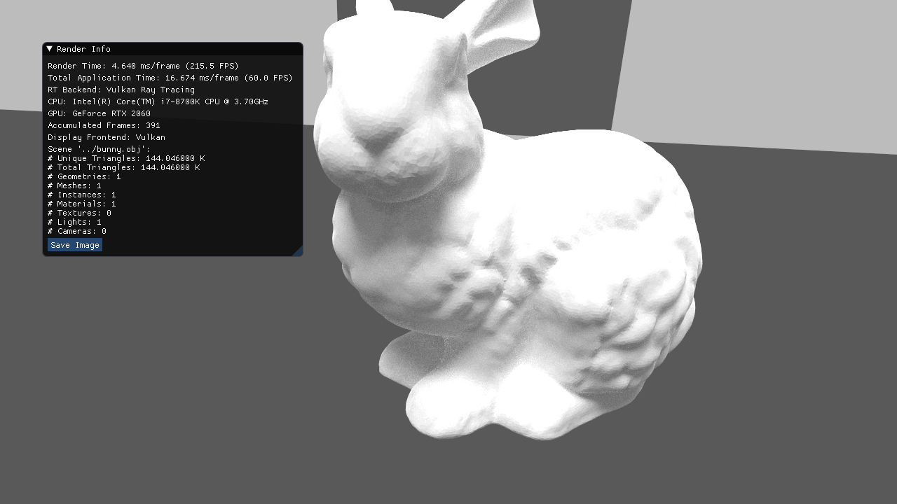
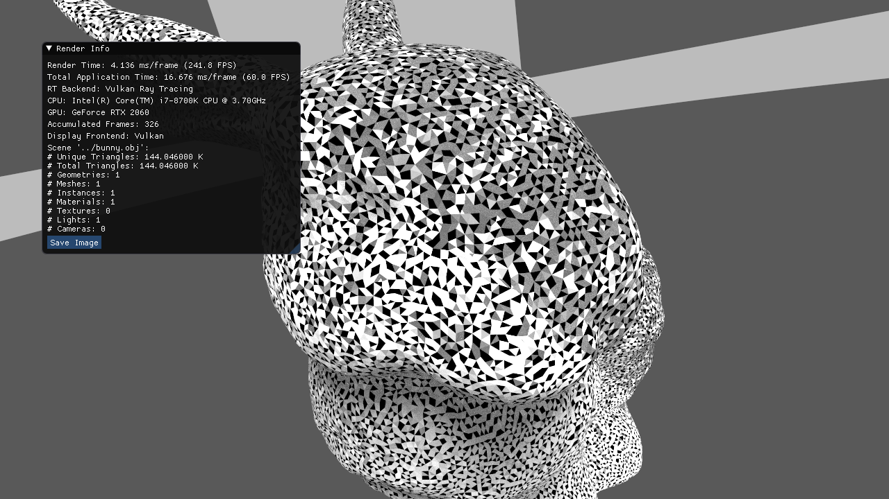

# pointer bug

build like this:

```
$ mkdir build
$ cd build

build$ cmake -DENABLE_VULKAN=1 ..
build$ make -j6
build$  ./chameleonrt -vulkan ../bunny.obj
```

I ported [hit.rchit](vulkan/hit.rchit) to [shaders.cxx](vulkan/shaders.cxx). See the attached compiled module [vulkan/circle_shaders.spv].

The rendering should look like this:


But it now looks like this:


The physical storage buffer pointers are not working.